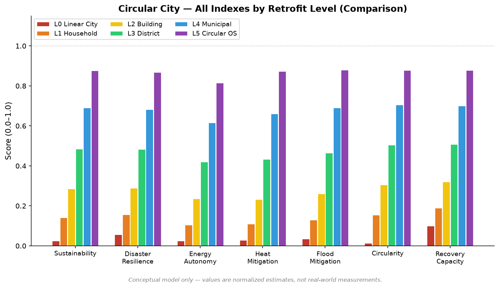
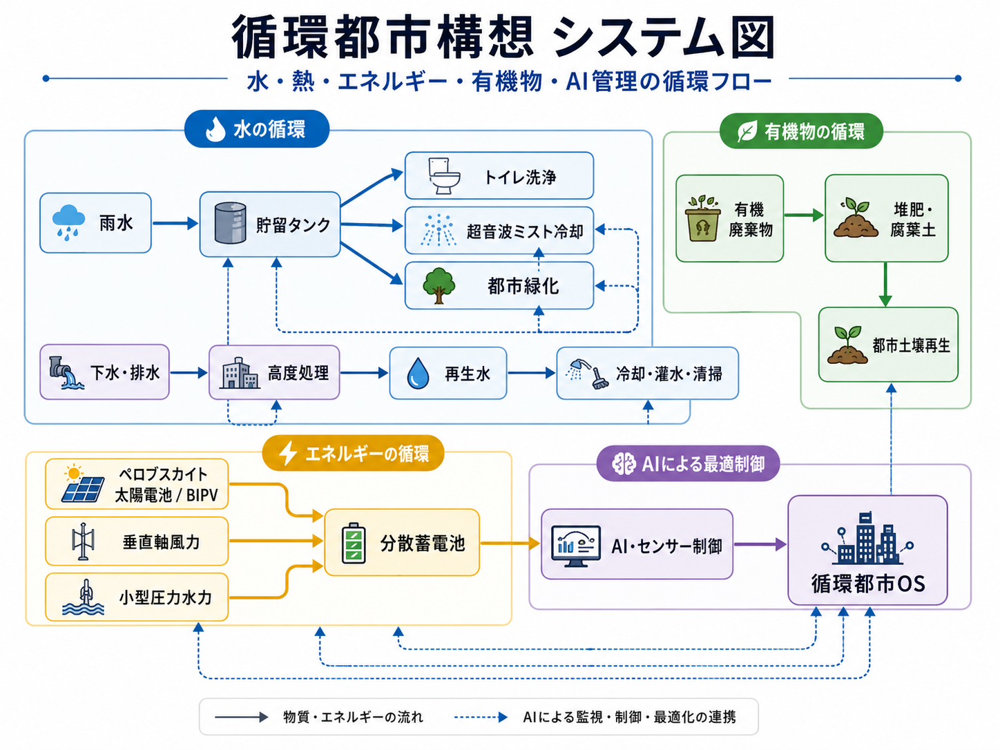
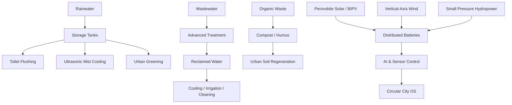
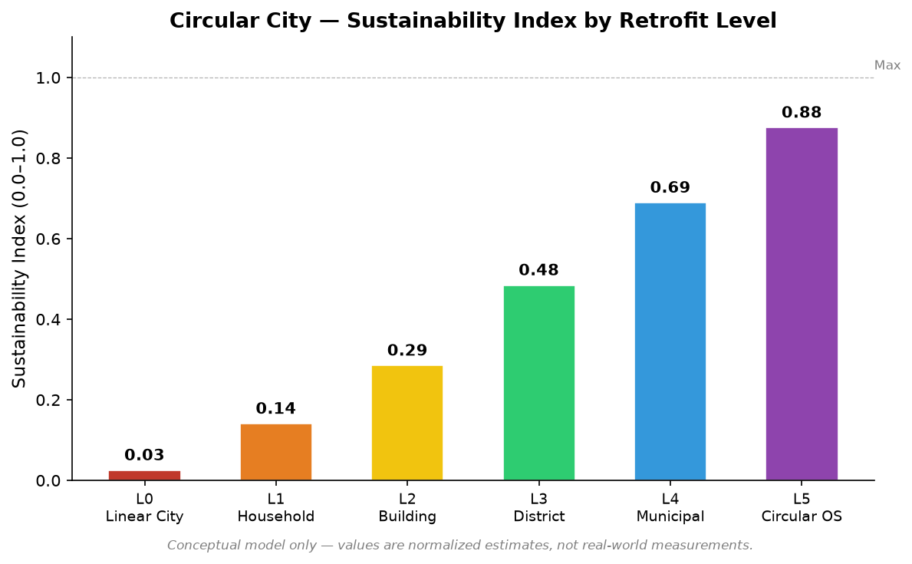
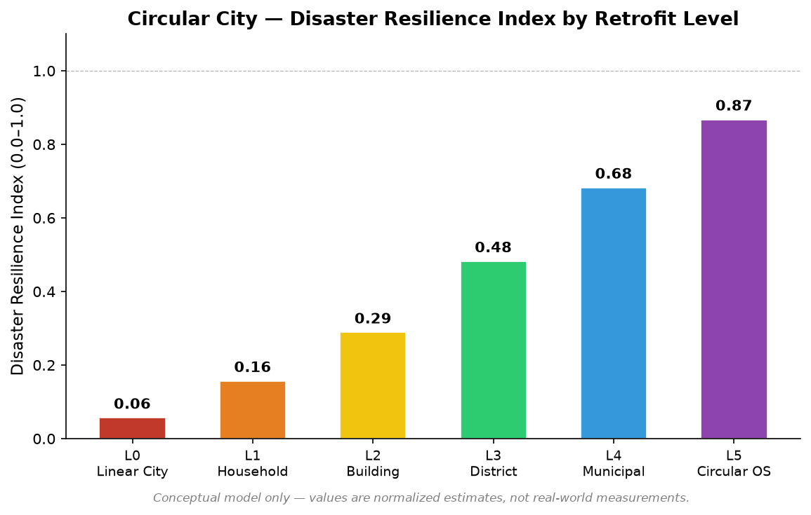
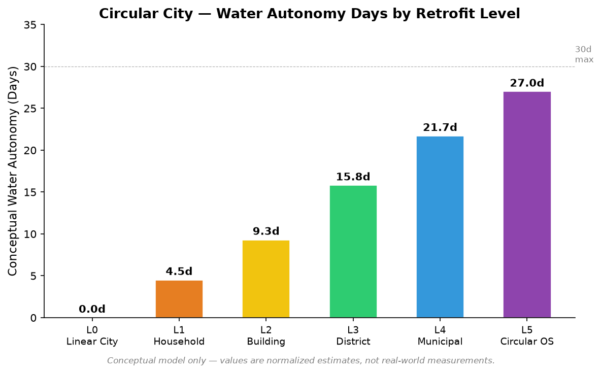
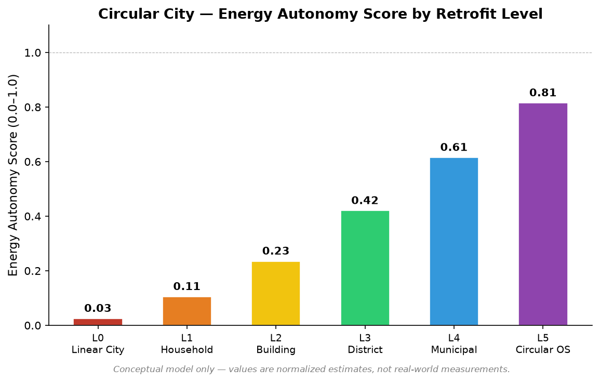
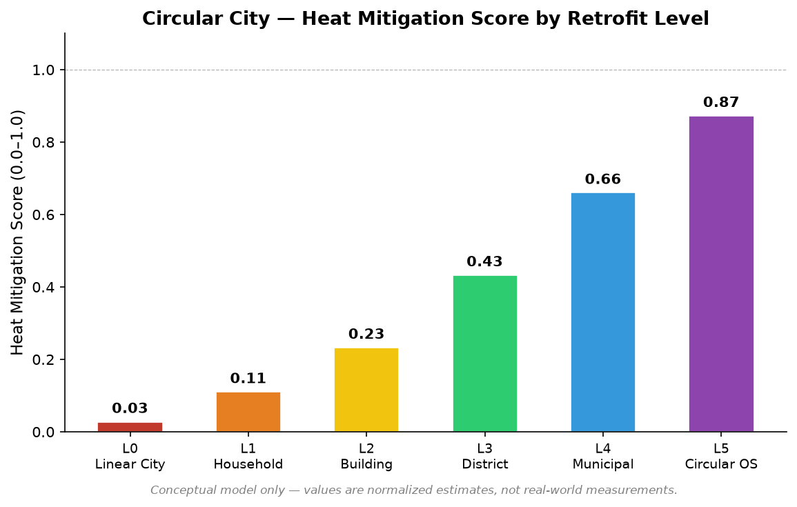
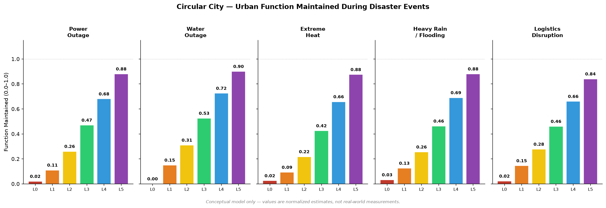

# Circular City Concept

## A Nature-Complementary Retrofit Model for Transforming Existing Cities into Water, Heat, Energy, Food, and Organic-Matter Circulation Systems

---

## Language / 言語

- [English](README.md)
- [日本語](README_ja.md)

---

## Overview

The **Circular City Concept** is an urban design framework for gradually transforming existing cities from artificial systems that consume resources and discharge heat and waste into **urban living infrastructures** that circulate water, heat, energy, food, and organic matter.

As an ideal form, a **Pyramid Circular City** may integrate architecture, water circulation, renewable energy, food production, waste treatment, disaster preparedness, and ecological regeneration from the beginning.

However, in the real world, most people already live in existing cities.
Therefore, the practical challenge is not only to design new future cities, but to retrofit existing houses, apartment buildings, office buildings, schools, hospitals, commercial facilities, wastewater treatment plants, roads, rivers, parks, and utility networks.

This repository proposes a practical implementation pathway by integrating:

* rainwater harvesting
* greywater reuse
* reclaimed water systems
* advanced reuse of treated wastewater
* ultrasonic mist cooling
* small-scale pressure-based hydropower
* distributed vertical-axis wind turbines
* perovskite solar cells
* building-integrated photovoltaics
* rooftop greening and green walls
* permeable pavements and rain gardens
* wastewater heat and drainage heat recovery
* organic-matter circulation and humus formation
* urban agriculture and indoor cultivation
* AI- and sensor-based urban circulation management

This concept is not a completed urban policy package or a fully proven implementation model.
It is a **conceptual and technical framework** that integrates existing technologies, emerging technologies, natural circulation principles, and urban infrastructure redesign.

---

## Representative Simulation Image



> Conceptual comparison of retrofit levels from Level 0 to Level 5.  
> This figure is part of the conceptual simulation and does not represent real-world prediction.

---

## Japanese System Diagram



---

## Repository Positioning

This repository organizes the Circular City Concept as a public framework from the perspectives of concept design, technical components, implementation phases, validation requirements, and integration with Urban OS / Civilization OS frameworks.
The NOTE article serves as a public-facing conceptual introduction, while the GitHub README and supplementary documents provide technical structure, implementation guidance, validation items, and system diagrams.

---

## Supplementary Documents

- [Implementation Guide: Houses, Apartments, Buildings, Districts, and Municipalities](IMPLEMENTATION_GUIDE.md)
- [System Diagram: Water, Heat, Energy, and Organic-Matter Flows](SYSTEM_DIAGRAM.md)
- [Validation Requirements: Water Quality, Safety, Governance, and Technology Readiness](VALIDATION_REQUIREMENTS.md)
- [Retrofit Levels: Level 0 to Level 5](RETROFIT_LEVELS.md)
- [Japanese NOTE update draft](NOTE_UPDATE_ja.md)

---

## SEO Information

### SEO Title

Circular City Concept: A Retrofit Urban Model for Water Circulation, Reclaimed Water, Rainwater Harvesting, Distributed Energy, and Perovskite Solar Cells

### Meta Description

The Circular City Concept is a nature-complementary retrofit model for transforming existing cities into circulation systems for water, heat, energy, food, and organic matter. It integrates rainwater harvesting, reclaimed water, ultrasonic mist cooling, small-scale hydropower, vertical-axis wind power, perovskite solar cells, wastewater reuse, urban greening, and organic-matter circulation.

---

## Table of Contents

* 1. What Is the Circular City Concept?
* 2. Background: Why Cities Lost Their Circulation
* 3. Core Thesis: Water Circulation Should Be Redesigned First
* 4. Existing-City Retrofitting as a Practical Pathway
* 5. Rainwater Harvesting Systems
* 6. Greywater and Intermediate Water Reuse
* 7. Advanced Use of Treated Wastewater and Reclaimed Water
* 8. Ultrasonic Mist Cooling and Urban Heat Mitigation
* 9. Small-Scale Pressure-Based Hydropower
* 10. Distributed Vertical-Axis Wind Turbines
* 11. Perovskite Solar Cells and Building-Integrated Photovoltaics
* 12. Rooftop Greening, Green Walls, Rain Gardens, and Permeable Pavements
* 13. Wastewater Heat and Drainage Heat Recovery
* 14. Organic-Matter Circulation and Urban Soil Regeneration
* 15. Urban Agriculture, Indoor Cultivation, and Emergency Food Production
* 16. AI and Sensors as a Circular City OS
* 17. Implementation Roadmap
* 18. Technology Readiness Matrix
* 19. Evaluation Indicators
* 20. Risks and Validation Requirements
* 21. Conclusion
* Author
* Collaborating AI
* Publication Month
* License
* Technical References
* Related Frameworks
* Keywords
* Hashtags

---

## Resource Flow Diagram



---

## 1. What Is the Circular City Concept?

The Circular City Concept is an urban design philosophy that aims to reuse and recirculate water, heat, energy, organic matter, nutrients, wastewater, rainwater, and food residues within the city as much as possible.

Conventional cities often follow a linear structure: they import resources from outside, consume them internally, and then discharge waste, wastewater, and heat outward.

```text
External resources
  ↓
Urban consumption
  ↓
Waste, wastewater, and heat discharge
```

This structure may appear convenient and efficient in the short term.
However, in an era of climate change, extreme heat, water scarcity, power outages, disasters, food supply instability, and aging infrastructure, it increases the vulnerability of cities.

The Circular City Concept seeks to transform this structure into a circular one.

```text
Rain, water, sunlight, wind, and organic matter
  ↓
Urban storage, use, and recovery
  ↓
Treatment, reuse, and recirculation
  ↓
Cooling, power generation, greening, food, and disaster resilience
```

A city is not merely an artificial object separated from nature.
A city is also a circulation system involving water, heat, wind, sunlight, soil, microorganisms, and human activity.

---

## 2. Background: Why Cities Lost Their Circulation

Modern cities developed by prioritizing sanitation, efficiency, transportation, and economic growth.

As a result, cities became dense and convenient, but they were gradually separated from natural circulation.

Typical problems include:

* rainwater is quickly drained away
* soil surfaces are covered with asphalt and concrete
* treated wastewater is often discharged rather than reused
* drinking-quality tap water is used for toilets and irrigation
* food waste and fallen leaves are incinerated
* buildings absorb solar heat and release air-conditioning waste heat
* urban wind and water flows are not used as energy resources
* roofs and walls are not fully used as power-generating surfaces
* green spaces and water bodies are treated as decoration rather than infrastructure

In this structure, a city becomes a device that consumes large amounts of resources while exporting heat, wastewater, and waste.

The purpose of the Circular City Concept is to reverse this one-way structure.

---

## 3. Core Thesis: Water Circulation Should Be Redesigned First

In a circular city, the first system to redesign should be **water circulation**.

Water is connected to almost every function of a city.

* drinking
* toilets
* laundry
* cleaning
* irrigation
* cooling
* firefighting
* agriculture
* greening
* water landscapes
* groundwater recharge
* emergency storage
* wastewater treatment
* power generation
* heat exchange

In many cities, water quality requirements are not sufficiently differentiated by use.

Drinking water requires strict safety.
However, toilet flushing, road sprinkling, planting, cooling, firefighting, and cleaning do not always require the same quality as drinking water.

A circular city classifies water according to its purpose.

| Water Type                     | Main Uses                                                      | Key Requirements                                                           |
| ------------------------------ | -------------------------------------------------------------- | -------------------------------------------------------------------------- |
| Potable water                  | drinking, cooking, bathing                                     | strict sanitary control                                                    |
| Rainwater                      | irrigation, cleaning, toilets, firefighting, cooling           | first-flush separation, filtration, disinfection, misconnection prevention |
| Greywater / intermediate water | toilets, irrigation, cleaning                                  | separate piping and water quality control                                  |
| Reclaimed water                | toilet flushing, irrigation, landscape water, industrial water | use-specific standards and monitoring                                      |
| Treated wastewater             | environmental water, agriculture, industry, cooling            | advanced treatment and pathogen / chemical control                         |
| Emergency water                | disaster use, firefighting                                     | long-term storage management                                               |

Water should not be treated as something that ends after one use.
It should be treated, reused, and returned to the city in stages according to its purpose.

This is the first principle of the Circular City Concept.

---

## 4. Existing-City Retrofitting as a Practical Pathway

As an ideal future model, a newly built Pyramid Circular City may be designed from the beginning as an integrated circular infrastructure.

However, the real challenge is the retrofitting of existing cities.

It is not realistic to demolish and rebuild all existing urban areas.
Therefore, the Circular City Concept emphasizes **retrofitting**, which means adding circular functions to existing buildings and infrastructure.

The targets include:

* detached houses
* apartment buildings
* office buildings
* commercial facilities
* factories
* schools
* hospitals
* public facilities
* railway stations
* roads
* parks
* rivers
* wastewater treatment plants
* water purification plants
* reservoirs
* rainwater pipes
* sewer pipes
* underground spaces

The basic strategy is:

1. create small circulation units
2. create building-scale circulation
3. connect them into district-scale circulation
4. expand them into municipal-scale circulation
5. manage the city as an integrated circulation OS

A circular city is not built all at once.
It emerges by increasing the number of small circulation nodes inside existing urban systems.

---

## 5. Rainwater Harvesting Systems

Rainwater harvesting is one of the simplest entry points for a circular city.

Rain that falls on roofs and walls usually flows through gutters and drains into the ground, sewers, or rivers.
By collecting, storing, and using part of this rainwater, urban water use can be redesigned.

### 5.1 Possible Uses

Rainwater can be used for:

* toilet flushing
* irrigation of gardens, street trees, and rooftop greenery
* cleaning
* evaporative cooling and traditional water sprinkling
* car washing
* firefighting water
* emergency living water
* ultrasonic mist cooling
* rain gardens and biotopes
* small-scale urban agriculture

Drinking use requires advanced treatment.
Therefore, early implementation should focus on non-potable uses.

### 5.2 Basic System Structure

```text
Roof / wall surface
  ↓
Gutter
  ↓
First-flush diversion
  ↓
Sedimentation
  ↓
Filtration
  ↓
Storage tank
  ↓
Purpose-specific use
  ↓
Excess water to infiltration, green spaces, or water channels
```

### 5.3 Technical Considerations

Rainwater use requires management of:

* first-flush separation
* removal of leaves, dust, and bird droppings
* prevention of algae, mosquitoes, and odor in tanks
* prevention of long-term stagnation
* warning labels to prevent accidental drinking
* prevention of cross-connection with potable water pipes
* regular cleaning
* emergency operation procedures

Rainwater may appear to be a free resource, but unmanaged rainwater can become a risk.
In a circular city, rainwater should be treated as a safely managed urban resource.

---

## 6. Greywater and Intermediate Water Reuse

Intermediate water refers to treated water that is not used for drinking but can be used for toilet flushing, irrigation, cleaning, and similar purposes.

Greywater refers to relatively low-contamination wastewater from baths, washbasins, and laundry.

In a circular city, these waters can be treated and reused at the building or district scale.

### 6.1 Possible Uses

* toilet flushing
* irrigation
* cleaning
* cooling water
* planting water
* industrial water
* landscape water

### 6.2 Benefits

* reduction of potable water demand
* reduction of sewer load
* emergency water availability
* connection with urban greening
* increased awareness of water circulation

### 6.3 Points of Caution

Greywater and intermediate water systems require management of:

* detergent components
* oils and fats
* microorganisms
* odor
* biofilm in pipes
* cross-connections
* maintenance
* compatibility with building and sanitary standards

Greywater reuse is effective, but unmanaged greywater can create sanitary risks.
Therefore, a circular city requires use-specific water quality standards, clear pipe labeling, and inspection systems.

---

## 7. Advanced Use of Treated Wastewater and Reclaimed Water

Wastewater is not merely dirty water.
It is a major urban resource flow containing water, heat, nitrogen, phosphorus, and organic matter.

Conventional wastewater treatment has played an essential role in protecting public health.
In the future, wastewater treatment plants should also be redesigned as central facilities for urban resource circulation.

### 7.1 Reclaimed Water Uses

Advanced treated wastewater can be used as reclaimed water for:

* toilet flushing
* irrigation
* landscape water
* recreational or amenity water
* industrial water
* cleaning water
* firefighting water
* urban water channels
* wetlands and biotopes
* agricultural water
* cooling water

### 7.2 Potable Reuse

In the future, potable reuse may become technically possible through multiple barriers such as advanced treatment, continuous monitoring, dilution, groundwater recharge, and conventional water purification.

However, potable reuse must be treated with extreme caution.

Required conditions include:

* multiple treatment barriers
* pathogen control
* trace chemical control
* pharmaceutical residue control
* PFAS and emerging contaminant control
* microplastic control
* continuous water quality monitoring
* automatic shutdown during abnormalities
* legal compatibility with potable water systems
* public agreement
* psychological acceptance
* independent third-party evaluation

The Circular City Concept does not propose immediate direct potable reuse.
The realistic path should begin with expanding non-potable reclaimed water use.

### 7.3 Transforming Wastewater Treatment Plants

In a circular city, wastewater treatment plants may become multi-functional resource recovery hubs.

Possible roles include:

* reclaimed water production
* heat recovery
* nitrogen and phosphorus recovery
* biogas production
* sludge fertilizer production
* emergency water supply
* regional agriculture support
* urban cooling water supply

The key shift is to transform wastewater treatment plants from “facilities that treat dirty water” into **urban resource circulation hubs**.

---

## 8. Ultrasonic Mist Cooling and Urban Heat Mitigation

Ultrasonic mist cooling is a promising option for mitigating extreme urban heat.

When water is atomized into fine mist, evaporation removes heat from the surrounding air.
This can produce local cooling effects.

### 8.1 Potential Locations

* station plazas
* bus stops
* schools
* parks
* shopping streets
* outdoor walkways
* areas near elderly-care facilities
* evacuation shelters
* factory sites
* rooftop gardens
* urban farms
* event venues

### 8.2 Connection with Rainwater and Reclaimed Water

Ultrasonic mist cooling requires water.
Instead of relying only on potable water, properly treated rainwater or reclaimed water may be used under appropriate safety controls.

```text
Rainwater / reclaimed water
  ↓
Filtration and disinfection
  ↓
Storage
  ↓
Sensor-based control
  ↓
Ultrasonic mist
  ↓
Local cooling
```

### 8.3 Safety Considerations

Because mist can be inhaled, water quality is critical.

Key issues include:

* Legionella and other microbial risks
* stagnant water in tanks
* biofilm in pipes
* nozzle contamination
* discomfort under high humidity
* slippery surfaces
* water droplet effects on nearby equipment
* regular cleaning
* automatic shutdown control

Mist cooling is not simply spraying water into the air.
It can function as urban cooling infrastructure only when water quality, operating conditions, and environmental monitoring are properly managed.

---

## 9. Small-Scale Pressure-Based Hydropower

Cities contain hidden water energy.

Examples include:

* water falling from rooftop tanks
* rainwater pipes
* reclaimed water pipes
* intermediate water pipes
* excess pressure in water supply pipes
* district-scale circulating water channels
* height differences inside wastewater treatment plants
* gravity flow from reservoirs

These flows and pressures may be recovered by small turbines in some locations.

### 9.1 Possible Uses

Small-scale pressure-based hydropower is unlikely to become a main urban power source.
However, it can be useful for small electricity demands such as:

* water level sensors
* water quality sensors
* pipe monitoring
* emergency lighting
* control units
* communication devices
* mist-cooling control
* pump assistance
* trickle charging of batteries
* minimum emergency power

### 9.2 Basic Structure

```text
Rainwater tank / reclaimed water tank
  ↓
Drop pipe / pressure pipe
  ↓
Small turbine
  ↓
Rectification and storage
  ↓
Sensors, lighting, and control devices
```

### 9.3 Limitations

Small-scale hydropower has several limitations.

* power output depends on flow rate and head
* rainwater flow is intermittent
* pipe resistance may increase
* clogging and foreign matter must be managed
* maintenance access is essential
* economic viability depends strongly on location

Therefore, in the Circular City Concept, small-scale pressure-based hydropower is treated as a distributed auxiliary power source, not as a main power supply.

---

## 10. Distributed Vertical-Axis Wind Turbines

Cities have wind, but urban wind is unstable.

It is disturbed by buildings, changes direction frequently, and fluctuates in strength.
Large horizontal-axis wind turbines are often difficult to install inside dense cities due to safety, noise, and wind-condition constraints.

Vertical-axis wind turbines may be more suitable for small-scale distributed urban wind use because they can respond to changing wind directions more easily.

### 10.1 Potential Installation Sites

* building rooftops
* riverfronts
* coastal areas
* port facilities
* under elevated structures
* bridge surroundings
* factory sites
* station areas
* roadside noise barriers
* public facilities

### 10.2 Possible Roles

* sensor power
* supplemental night lighting
* battery support
* small emergency power
* water circulation pump assistance
* distributed power in public spaces

### 10.3 Points of Caution

Urban wind systems require careful attention to:

* noise
* vibration
* falling or breakage risks
* emergency shutdown during strong winds
* bird impacts
* low-frequency noise
* maintenance
* unstable generation
* public acceptance

Urban wind should not be overestimated.
In a circular city, it should be treated as an auxiliary source combined with solar power, small hydropower, and batteries.

---

## 11. Perovskite Solar Cells and Building-Integrated Photovoltaics

In a circular city, roofs, walls, windows, balconies, exterior materials, station buildings, parking areas, and noise barriers should be redesigned as power-generating surfaces.

One promising candidate is the perovskite solar cell.

Perovskite solar cells are attracting attention as next-generation solar cells because they may be lightweight, thin-film, flexible, and suitable for building-integrated applications.

### 11.1 Potential Applications

* roofs
* exterior walls
* window glass
* balconies
* parking roofs
* station buildings
* bus stops
* warehouses
* factory walls
* schools
* hospitals
* public facilities
* noise barriers
* temporary evacuation shelters

### 11.2 Role in a Circular City

Perovskite solar cells and building-integrated photovoltaics may support:

* transformation of buildings into power-generating surfaces
* distributed power generation
* emergency power
* integration with mist cooling
* integration with rainwater pumps
* power supply for sensors and AI management systems
* connection with batteries
* local use of surplus power

### 11.3 Validation Requirements

Although promising, perovskite solar cells require further validation before being used widely as urban infrastructure.

Key issues include:

* long-term durability
* encapsulation technology
* fire safety
* safety as building material
* management of lead and other materials
* recycling
* recovery systems
* construction methods
* degradation of generation performance
* stable mass production
* compatibility with building codes
* resistance to typhoons, snow, and salt damage

Therefore, this concept does not treat perovskite solar cells as a completed technology ready for immediate citywide deployment.
They should be introduced gradually, starting with public facilities and demonstration buildings, while accumulating performance data.

---

## 12. Rooftop Greening, Green Walls, Rain Gardens, and Permeable Pavements

A circular city must redesign the surface of the city.

Asphalt, concrete, glass, and metal store heat, repel rainwater, and dry out the urban environment.

Therefore, the city surface should regain green and water-absorbing layers.

### 12.1 Rooftop Greening

Rooftop greening may contribute to insulation, rainwater retention, heat island mitigation, and biodiversity recovery.

Important considerations include:

* structural load
* waterproofing
* root intrusion
* wind protection
* irrigation
* fallen leaf management
* maintenance cost

### 12.2 Green Walls

Green walls may reduce building surface temperature, improve scenery, and support urban microclimate regulation.

Important considerations include:

* support structure
* water management
* pest control
* management when plants die
* exterior wall degradation
* fire safety

### 12.3 Rain Gardens

A rain garden is a planted area that temporarily receives rainwater and allows it to infiltrate, evaporate, and be partially purified through soil and plants.

In a circular city, rain gardens can be placed along roads, in parks, schools, public facilities, and residential areas to reduce stormwater runoff and restore urban water circulation.

### 12.4 Permeable Pavements

Permeable pavements allow rainwater to infiltrate rather than immediately flow into drainage systems.

However, clogging, soil conditions, groundwater levels, freezing, and pollutant infiltration must be evaluated.

The urban ground surface should be changed from a surface that repels water into one that receives water.
This is a key retrofit strategy for circular cities.

---

## 13. Wastewater Heat and Drainage Heat Recovery

Urban drainage and wastewater contain heat.

Wastewater from bathing, laundry, kitchens, factories, and building air-conditioning systems may be used as a heat resource before being discharged.

### 13.1 Potential Uses

* preheating of hot water
* district heating and cooling
* heat pumps
* greenhouses
* indoor farming
* public facilities
* hospitals
* swimming pools
* wastewater treatment plants

### 13.2 Significance

Wastewater heat and drainage heat recovery can improve urban energy circulation.

Water is not only a liquid resource.
It is also a heat transport medium.

In a circular city, water should be treated not only as water infrastructure, but also as thermal infrastructure.

---

## 14. Organic-Matter Circulation and Urban Soil Regeneration

Cities contain large amounts of organic matter.

Examples include:

* food waste
* fallen leaves
* pruned branches
* food industry residues
* paper materials
* sewage sludge
* park residues
* agricultural residues
* wood chips

Currently, much of this material is incinerated, disposed of, or transported outside the city.

However, with proper separation, treatment, and sanitary control, it may be reused as compost, leaf mold, soil conditioner, biogas feedstock, mushroom substrate, or urban agriculture material.

### 14.1 Organic-Matter Circulation Flow

```text
Urban organic matter
  ↓
Separation
  ↓
Removal of foreign materials
  ↓
Composting / humus formation / biogas production
  ↓
Safety confirmation
  ↓
Return to urban greening, farmland, parks, and rooftop gardens
```

### 14.2 Points of Caution

Organic-matter circulation requires management of:

* pathogens
* odor
* pests
* heavy metals
* pesticide residues
* pharmaceutical residues
* microplastics
* salt
* foreign materials
* fermentation temperature
* maturity
* application rate

Natural origin does not automatically mean safe.
In a circular city, organic matter should be treated neither as mere waste nor as an unconditional resource, but as a **managed circular resource**.

---

## 15. Urban Agriculture, Indoor Cultivation, and Emergency Food Production

A circular city does not need to produce all of its food internally.

However, maintaining some food production functions inside the city can support resilience during disasters, logistics disruptions, extreme heat, and droughts.

### 15.1 Candidate Crops

Relatively suitable candidates for urban cultivation include:

* leafy greens
* herbs
* seedlings
* mushrooms
* sprouts
* small fruiting vegetables
* emergency crops
* experimental hydroponic crops

### 15.2 Urban Circulations to Connect

Urban agriculture can become energy- and water-intensive if implemented in isolation.

In a circular city, it should be connected with:

* rainwater
* reclaimed water
* solar power
* batteries
* waste heat
* organic compost
* CO₂ utilization
* sensor management
* local logistics
* school education
* disaster stockpiling

Urban agriculture should not be treated merely as a hobby.
It should be designed as an urban function connecting water, energy, organic matter, education, and disaster resilience.

---

## 16. AI and Sensors as a Circular City OS

A circular city must coordinate water, electricity, heat, generation, storage, weather, wastewater, rainwater, reclaimed water, and green infrastructure.

This is where AI and sensors become important.

AI should not be used to dominate the city.
It should be used to **tune urban circulation**.

### 16.1 Monitoring Targets

* rainfall
* tank water level
* water quality
* pipe pressure
* flow rate
* power generation
* battery charge
* air temperature
* humidity
* land surface temperature
* heatstroke risk
* wastewater flow
* reclaimed water quality
* soil moisture
* plant condition
* disaster information

### 16.2 Roles of AI

* adjusting tank capacity according to rainfall forecasts
* automatic mist-cooling control
* detecting water quality abnormalities
* detecting pipe leakage
* optimizing generation and storage
* adjusting reclaimed water use
* prioritizing water and power during disasters
* identifying heatstroke-risk locations
* optimizing irrigation for green spaces
* predicting maintenance timing

Managing urban circulation by human labor alone is difficult.
AI should function as a tuner between natural circulation and urban infrastructure.

---

## 17. Implementation Roadmap

A circular city cannot be completed all at once.
It requires phased implementation.

### Phase 1: Households and Small Facilities

* rainwater tanks
* rainwater for toilet flushing
* rainwater for irrigation and cleaning
* balcony greening
* food waste composting
* small solar power
* insulation retrofits
* emergency water storage

### Phase 2: Apartment Buildings and Office Buildings

* rooftop rainwater storage
* intermediate water reuse
* greywater reuse
* non-potable reclaimed water
* rooftop greening
* green walls
* small-scale pressure hydropower
* perovskite solar cell demonstrations
* batteries
* drainage heat recovery

### Phase 3: Districts

* district reclaimed-water pipes
* rain gardens
* permeable pavements
* mist cooling networks
* urban farms
* organic-matter collection stations
* district batteries
* vertical-axis wind turbine demonstrations
* green corridors
* firefighting water networks

### Phase 4: Municipalities

* advanced use of treated wastewater
* public use of reclaimed water
* wastewater heat recovery
* emergency water source networks
* conversion of public facilities into power-generating surfaces
* circularization of schools, hospitals, and evacuation shelters
* redesign of parks, rivers, and water channels
* integrated urban data management for water, heat, and power

### Phase 5: Circular City OS

At the final stage, the entire city is managed as one integrated OS.

```text
Rain
  ↓
Storage
  ↓
Use
  ↓
Treatment
  ↓
Reuse
  ↓
Cooling
  ↓
Greening
  ↓
Power generation
  ↓
Food
  ↓
Organic matter
  ↓
Soil
  ↓
Urban living sphere
```

---

## 18. Technology Readiness Matrix

| Technology Element                   |      Readiness | Position                                                          |
| ------------------------------------ | -------------: | ----------------------------------------------------------------- |
| Rainwater harvesting                 |           High | Existing technology; use-specific management is essential         |
| Greywater / intermediate water reuse | High to medium | Applicable at building and district scale                         |
| Reclaimed water use                  | High to medium | Requires use-specific standards and public agreement              |
| Potable reuse                        |  Medium to low | Requires advanced treatment, legal systems, and public acceptance |
| Ultrasonic mist cooling              |         Medium | Water quality and operating conditions are critical               |
| Small-scale pressure hydropower      |  Medium to low | Site-dependent; suitable as auxiliary power                       |
| Vertical-axis wind power             |  Medium to low | Depends on urban wind conditions and safety                       |
| Perovskite solar cells               |  Medium to low | Durability, mass production, and recovery systems remain issues   |
| Rooftop greening                     | High to medium | Load, waterproofing, and maintenance are important                |
| Green walls                          |         Medium | Structure, water management, and fire safety are issues           |
| Permeable pavements                  | High to medium | Clogging and soil conditions must be managed                      |
| Rain gardens                         | High to medium | Local design and maintenance are important                        |
| Wastewater heat recovery             |         Medium | Must connect with local heat demand                               |
| Organic composting                   |           High | Sanitary and contamination control are essential                  |
| Urban agriculture                    |         Medium | Energy, water, and economic viability must be considered          |
| AI circulation management            |         Medium | Data integration, standardization, and safety are key issues      |

---

## 19. Evaluation Indicators

The Circular City Concept should be evaluated not only by philosophy, but by measurable indicators.

### 19.1 Water Circulation Indicators

* reduction rate of potable water use
* rainwater use volume
* reclaimed water use volume
* greywater / intermediate water use volume
* emergency water storage days
* infiltration surface area
* stormwater runoff reduction
* treated wastewater reuse rate

### 19.2 Thermal Environment Indicators

* reduction in surface temperature
* cooling effect of mist systems
* shaded area
* heatstroke risk reduction
* cooling electricity reduction
* nighttime temperature reduction

### 19.3 Energy Indicators

* distributed power generation
* battery capacity
* disaster-time autonomy duration
* small hydropower generation
* solar generation surface area
* wind auxiliary generation
* public facility self-reliance rate

### 19.4 Organic Matter and Food Indicators

* food waste recovery volume
* compost production
* leaf mold production
* urban agriculture production
* soil organic matter increase
* food waste reduction rate

### 19.5 Social Indicators

* resident participation rate
* maintenance cost
* disaster function continuity
* number of public facilities introduced
* participation in water-circulation education
* status of local consensus building

---

## 20. Risks and Validation Requirements

The Circular City Concept has many potential benefits, but careful validation is essential.

### 20.1 Water Quality Risks

* rainwater contamination
* bacterial growth in tanks
* inhalation risk from mist
* accidental drinking of reclaimed water
* pipe cross-connections
* trace chemicals
* pathogens
* emerging contaminants

### 20.2 Technical Risks

* clogging in small hydropower systems
* noise and vibration from wind turbines
* degradation of solar cells
* battery fire risks
* sensor failure
* AI misjudgment
* insufficient maintenance

### 20.3 Architectural and Urban Risks

* rooftop greening load
* water leakage
* exterior wall degradation
* earthquake safety
* typhoon safety
* ground effects of infiltration
* equipment renewal cost

### 20.4 Social Risks

* psychological resistance by residents
* lack of operators
* cost burden
* coordination among property owners
* insufficient legal systems
* unclear maintenance responsibility

A circular city is not completed simply by adding devices.
Technology, institutions, operation, education, consensus building, and maintenance must be designed together.

---

## 21. Conclusion

The essence of the Circular City Concept is to redesign the city not as an artificial object separated from nature, but as a living infrastructure within natural circulation.

The Pyramid Circular City is important as an ideal form.
However, the most important practical question is how to transform existing cities.

The first step is water circulation.

Store rainwater.
Use reclaimed water.
Treat wastewater as a resource.
Use water for cooling.
Convert a small part of water pressure and falling water into electricity.
Generate power from roofs and walls.
Use urban wind as auxiliary energy.
Return organic matter to soil instead of burning it.
Cool the city with greenery and water.
Tune circulation with AI and sensors.

Through these accumulated actions, cities can move from being mere consumption devices toward becoming circular foundations of civilization.

Future cities should not develop by excluding nature.
They should persist by understanding natural principles and repositioning civilization inside natural circulation.

A circular city is not a plan to decorate the city with nature.
It is a plan to return the city itself to the circulation of nature.

---

## Conceptual Simulation

This repository includes a Python-based conceptual simulation that compares sustainability and disaster resilience across retrofit levels from Level 0 to Level 5.

- [Circular City Concept Simulation Model](SIMULATION_MODEL.md)
- [`circular_city_resilience_simulation.py`](circular_city_resilience_simulation.py)

> This simulation is conceptual.  
> It does not predict real cities, real disaster outcomes, or actual infrastructure performance.

### Simulation Outputs














---

## Author

Master
Alias / Handles: inchacomisho / inchacomusho

---

## Collaborating AI

This concept and document were created through dialogue, organization, structuring, and technical expression support based on the author’s original concept, with assistance from the following AI systems:

* G: ChatGPT by OpenAI
* Mini: Gemini by Google
* Clus: Claude by Anthropic
* Real: Perplexity AI
* Lola (Dola)
* Mana: Manus

> Note: The collaborating AI systems supported text organization, structuring, translation, and technical expression.
> The original conceptual direction, causal interpretation, and final responsibility belong to the author.

---

## Publication Month

June 2026

---

## Original NOTE Article

- [循環都市構想 / Circular City Concept](https://note.com/inchacomusho/n/n734d7e7da6ce)

---

## License

CC BY-SA 4.0

This article, concept, text, and structure are released under the Creative Commons Attribution-ShareAlike 4.0 International License.

The following are permitted:

* sharing
* translation
* adaptation
* remixing
* redistribution
* commercial use

Conditions:

* appropriate attribution must be given to the author
* derivative works must be shared under the same license

---

## Technical References

* Ministry of Land, Infrastructure, Transport and Tourism, Japan
  “Rainwater Utilization Status”  
  https://www.mlit.go.jp/mizukokudo/mizsei/mizukokudo_mizsei_tk1_000055.html

* Ministry of Land, Infrastructure, Transport and Tourism, Japan
  “Guidelines for Promoting Rainwater Utilization”  
  https://www.mlit.go.jp/mizukokudo/mizsei/content/001879708.pdf

* Ministry of Land, Infrastructure, Transport and Tourism, Japan
  “Manual on Water Quality Standards for Reclaimed Wastewater”  
  https://www.mlit.go.jp/kisha/kisha05/04/040422/05.pdf

* Ministry of Land, Infrastructure, Transport and Tourism, Japan
  “Toward Revision of the Manual on Water Quality Standards for Reclaimed Wastewater”  
  https://www.mlit.go.jp/mizukokudo/sewerage/content/001989277.pdf

* Ministry of Land, Infrastructure, Transport and Tourism, Japan
  “BISTRO Sewerage”  
  https://www.mlit.go.jp/mizukokudo/sewerage/mizukokudo_sewerage_tk_000565.html

* NEDO
  “Development of Next-Generation Solar Cells”  
  https://green-innovation.nedo.go.jp/project/next-generation-solar-cells/

* NEDO
  “Technology Development for Wall-Mounted Solar Power Generation Systems”  
  https://www.nedo.go.jp/content/800031725.pdf

* NEDO
  “Design and Construction Guidelines for Photovoltaic Systems Using Flexible Solar Cells”  
  https://www.nedo.go.jp/news/press/AA5_101922.html

* Bideris-Davos, A. A., & Vovos, P. N.
  “Comprehensive Review for Energy Recovery Technologies Used in Water Distribution Systems Considering Their Performance, Technical Challenges, and Economic Viability.”
  *Water*, 2024.  
  https://www.mdpi.com/2073-4441/16/15/2129

---

## Related Frameworks

* [Master Knowledge Portal](https://github.com/InchaComisho/Master-Knowledge-Portal)

* [Civilization OS Framework](https://github.com/InchaComisho/Civilization-OS-Framework)

* [Urban–Civilization OS: A Circular Infrastructure Framework for Nature-Integrated Cities](https://github.com/InchaComisho/Urban-Civilization-OS-A-Circular-Infrastructure-Framework-for-Nature-Integrated-Cities)

* [Civilization OS](https://github.com/InchaComisho/Civilization-OS)

* [REIMEI Civilization OS / Next Civilization OS](https://github.com/InchaComisho/REIMEI-Civilization-OS)

* [Natural–Microbial OS](https://github.com/InchaComisho/Natural-Microbial-OS)

* [Planetary Heat and Circulation OS](https://github.com/InchaComisho/Planetary-Heat-Circulation-OS)

* [Desert Regeneration and Food Production Through Organic Matter Circulation](https://github.com/InchaComisho/Desert-Regeneration-and-Food-Production-Through-Organic-Matter-Circulation)

---

## Keywords

Circular City, Circular City Concept, Urban OS, Civilization OS, Retrofit City, Existing City Retrofit, Nature-Complementary Science, Water Circulation, Rainwater Harvesting, Greywater Reuse, Intermediate Water, Reclaimed Water, Wastewater Reuse, Treated Wastewater, Advanced Water Purification, Potable Reuse, Urban Cooling, Ultrasonic Mist Cooling, Heat Island Mitigation, Small-Scale Hydropower, Pressure-Based Hydropower, In-Pipe Hydropower, Distributed Power Generation, Vertical-Axis Wind Turbine, Urban Wind Power, Perovskite Solar Cells, Building-Integrated Photovoltaics, BIPV, Rooftop Greening, Green Walls, Rain Gardens, Permeable Pavement, Wastewater Heat Recovery, Drainage Heat Recovery, Organic-Matter Circulation, Humus Formation, Urban Agriculture, Indoor Cultivation, Emergency Water Supply, Distributed Infrastructure, Sustainable Cities, Climate Change Adaptation, Global Warming Countermeasures, Urban Regeneration, Smart Cities, AI Urban Management, Circular Infrastructure

---

## Hashtags

#CircularCity #CircularCityConcept #UrbanOS #CivilizationOS #RetrofitCity #ExistingCityRetrofit #NatureComplementaryScience #WaterCirculation #RainwaterHarvesting #GreywaterReuse #ReclaimedWater #WastewaterReuse #UltrasonicMistCooling #HeatIslandMitigation #SmallScaleHydropower #PressureHydropower #VerticalAxisWindTurbine #UrbanWindPower #PerovskiteSolarCells #BuildingIntegratedPhotovoltaics #BIPV #RooftopGreening #GreenWalls #RainGarden #PermeablePavement #WastewaterHeatRecovery #DrainageHeatRecovery #OrganicMatterCirculation #HumusFormation #UrbanAgriculture #IndoorCultivation #EmergencyWaterSupply #DistributedInfrastructure #SustainableCities #ClimateChangeAdaptation #UrbanRegeneration #SmartCity #AIUrbanManagement
