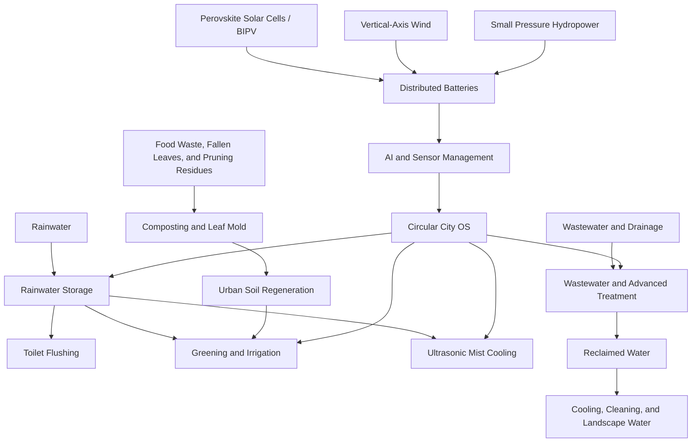
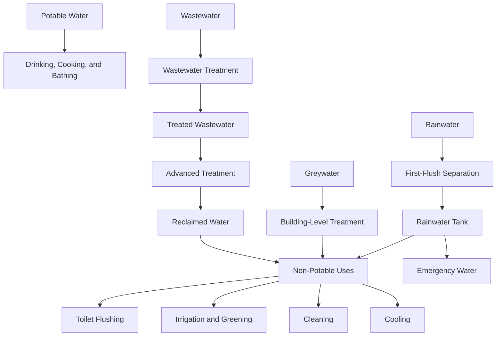
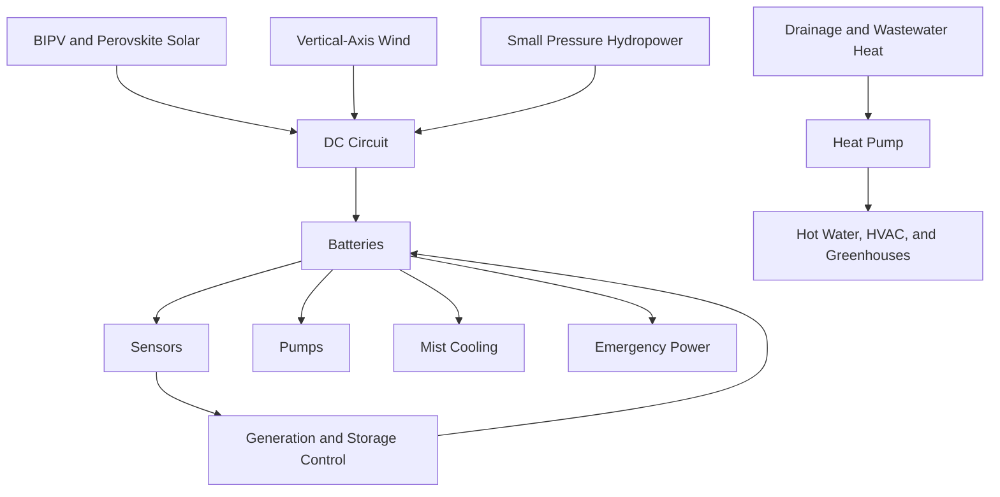
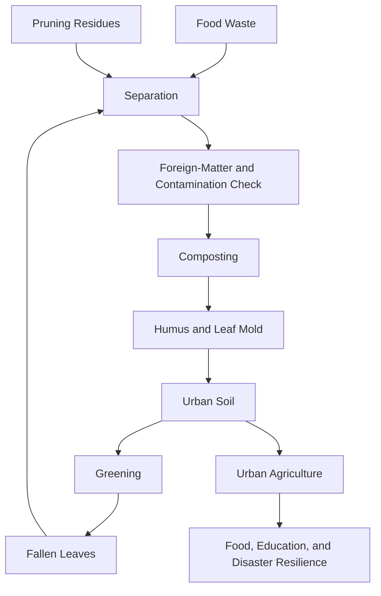
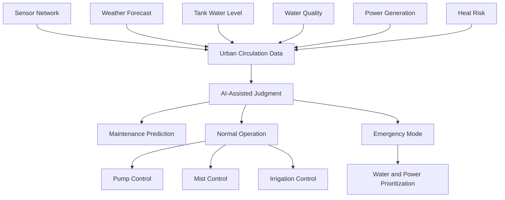

# Circular City Concept System Diagram
## Circulation Flows of Water, Heat, Energy, Organic Matter, Food, and AI Management

---

## Purpose of This Document

This document visualizes the Circular City Concept described in the README as relationships among water, heat, energy, organic matter, food, and AI management. The diagrams do not represent an already implemented system; they organize structure for validation and phased deployment.

---

## 1. Overall Circular City Flow

---

## 2. Water Circulation Diagram

---

## 3. Energy Circulation Diagram

---

## 4. Organic Matter and Soil Diagram

---

## 5. AI Control Layer Diagram

---

## Node Explanations

| Node | Role |
| --- | --- |
| Rainwater storage | Entry point for using roof and wall runoff for non-potable purposes |
| Wastewater and advanced treatment | Hub for protecting public health while connecting to reclaimed water, heat, and resource recovery |
| Distributed batteries | Buffer variable solar, wind, and small hydropower generation |
| Urban soil regeneration | Connect organic-matter circulation with greening and urban agriculture |
| AI and sensor management | Support monitoring, anomaly detection, maintenance prediction, and emergency switching |

---

## Failure Points and Safety Control Points

| Area | Failure Point | Safety Control Point |
| --- | --- | --- |
| Water | Cross-connection, stagnation, bacterial growth, filter clogging | Labels, backflow prevention, water-quality monitoring, regular cleaning |
| Mist | Legionella, nozzle contamination, slippery surfaces | Disinfection, shutdown conditions, cleaning records |
| Energy | Battery degradation, overheating, unstable generation | Certified devices, temperature monitoring, disconnect devices |
| Organic matter | Odor, pests, heavy metals, microplastics | Separation, testing, maturity confirmation, input restrictions |
| AI | Sensor failure, misjudgment, black-box control | Human final authority, logs, manual fallback |

---

## Relationship to the README

The README explains the main thesis, technical elements, and roadmap of the Circular City Concept. This document reorganizes that concept as diagrams and shows which circulation each element belongs to and where validation, maintenance, and safety controls are required.

---

## Author

Master / inchacomusho / InchaComisho

An independent Japanese concept designer, observer, proposer, AI tuner, and definer of Artificial Wisdom.  
Founder and advocate of the academic framework of Natural Complementary Science.  
Publicly active in natural-law philosophy, planetary circulation restoration, and co-creation with AI.

---

## License

CC BY 4.0

This article is released under the Creative Commons Attribution 4.0 International License (CC BY 4.0).  
Sharing, redistribution, translation, adaptation, and reuse are permitted as long as proper attribution is given.
