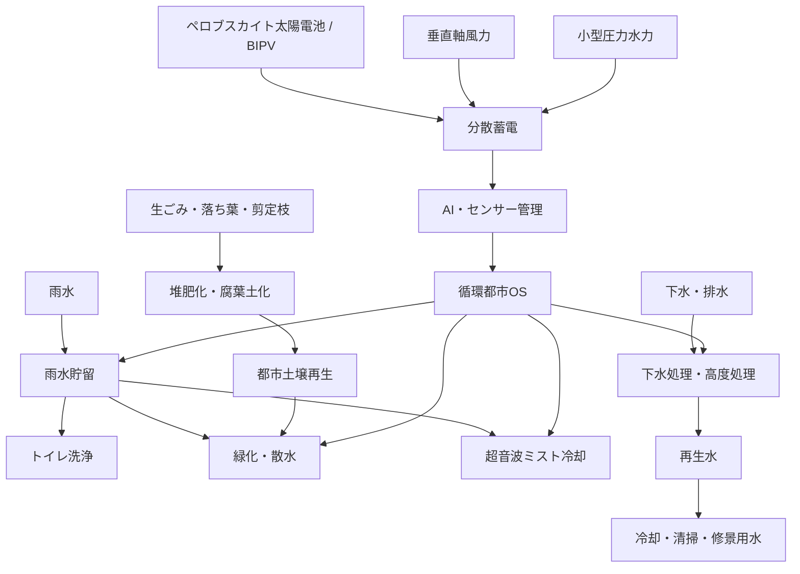
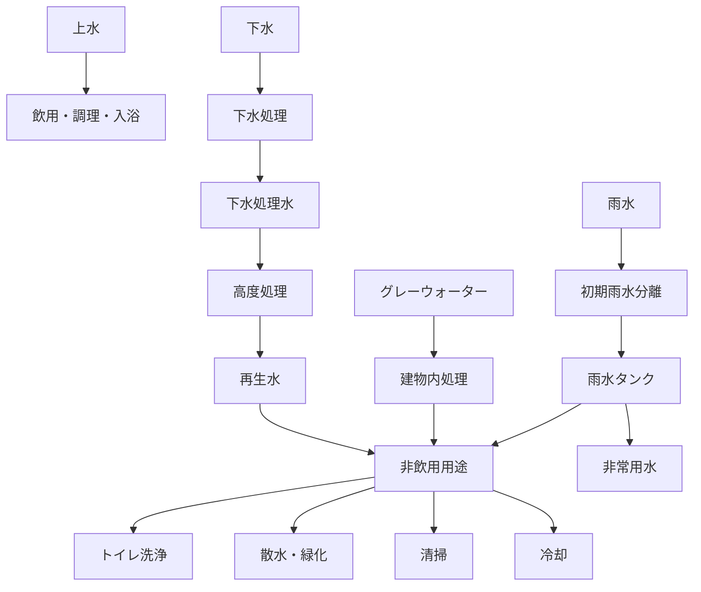
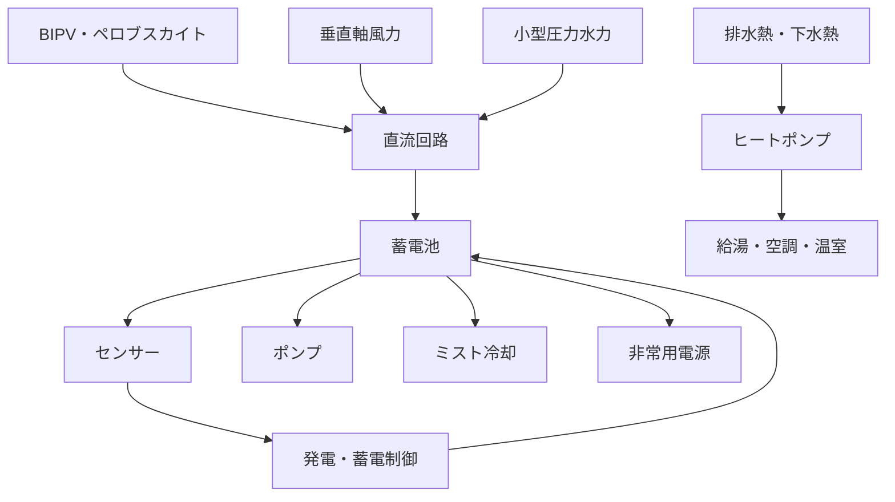
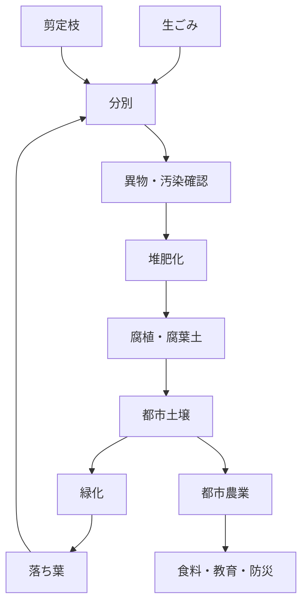
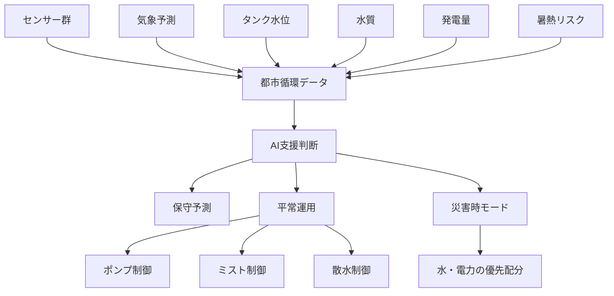

# 循環都市構想 システム図
## 水・熱・エネルギー・有機物・食料・AI管理の循環フロー

---

## この文書の目的

この文書は、READMEで説明した循環都市構想を、水、熱、エネルギー、有機物、食料、AI管理の関係として図解する。図は実装済みシステムを示すものではなく、検証と段階導入のための構造整理である。

---

## 1. 全体循環フロー

---

## 2. 水循環図

---

## 3. エネルギー循環図

---

## 4. 有機物・土壌循環図

---

## 5. AI制御レイヤー図

---

## ノードの説明

| ノード | 役割 |
| --- | --- |
| 雨水貯留 | 屋根・外壁の雨水を非飲用用途に使う入口 |
| 下水処理・高度処理 | 公衆衛生を守りながら再生水・熱・資源回収へ接続する拠点 |
| 分散蓄電 | 太陽光、風力、小型水力の変動を吸収する |
| 都市土壌再生 | 有機物循環と緑化・都市農業をつなぐ |
| AI・センサー管理 | 監視、異常検知、保守予測、災害時切替を支援する |

---

## 故障点と安全制御点

| 領域 | 故障点 | 安全制御点 |
| --- | --- | --- |
| 水 | 誤接続、滞留、細菌増殖、フィルター詰まり | 表示、逆流防止、水質監視、定期洗浄 |
| ミスト | レジオネラ、ノズル汚染、滑り | 殺菌、停止条件、清掃記録 |
| エネルギー | 蓄電池劣化、過熱、発電不安定 | 認証機器、温度監視、遮断装置 |
| 有機物 | 悪臭、害虫、重金属、マイクロプラスチック | 分別、検査、完熟確認、搬入制限 |
| AI | センサー故障、誤判断、ブラックボックス化 | 人間の最終判断、ログ、手動切替 |

---

## READMEとの関係

READMEは循環都市構想の本文、技術要素、ロードマップを説明する。本書はその構想を図として再配置し、各要素がどの循環に属し、どこで検証・保守・安全制御が必要になるかを示す補足資料である。
